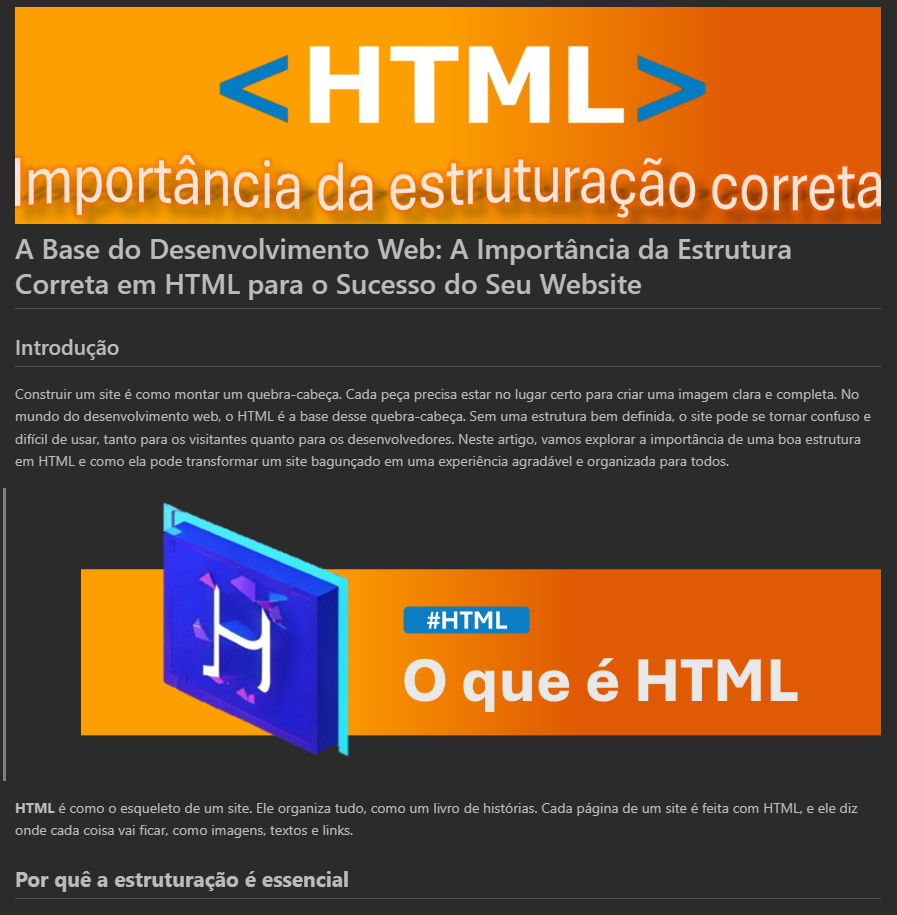

    

  
  

-------

  

# Projeto artigo técnico gerado por I.A.s

 > ℹ️ **NOTE:** Este é o repositório o qual foi feito um Fork para ser usado como base referente ao projeto de criação de artigo. O repositório original pode ser acessado através do link: [prompts-for-article-generate-by-ia](https://github.com/felipeAguiarCode/prompts-for-article-generate-by-ia)

Projeto com o objetivo de gerar um artigo técnico com um layout rico, leitura agradável e com foco em promover autoridade técnica.

<a href="./Artigo.md" title="View PDF now"> 📕Clique aqui para ler o artigo</a>

## 💻 Tecnologias utilizadas no projeto

- [ChatGPT](https://chat.openai.com/) - para título e conteúdo
- [Lexica.art](https://lexica.art/) - para gerar imagens
- [PowerPoint](https://www.microsoft.com/en/microsoft-365/powerpoint) - Para formatação de banners e Layouts

## 📄 Prompts e ferramentas

ChatGPT：
|   Ação   | Prompt                                                                                                                                                                                                                           |
| :------: | --------------------------------------------------------------------------------------------------------------------------------------------------------------------------------------------------------------------------------- |
|  título  | Crie 10 headlines para nomes de artigos sobre: HTML - estrutura                                                                                                                            |
| conteúdo | Comporte-se como um escritor de artigos tech front-end e escreva artigo atendendo as regras abaixo {REGRAS}   No máximo 5 linhas por blocos de explicação   Me explique de uma maneira informal, como se fosse uma criança de 10 anos   Os blocos que serão criados estão abaixo   - O que é HTML   - Por quê a estruturação é essencial   - Impacto da estrutura na experiência do usuário   - Tags fundamentais do HTML   - Estrutura padrão do head   - Estrutura padrão do body   - Section ou div? Quando e porque utilizar   - A importância de classes e id   - Qual utilização correta de semântica HTML   - Como a estrutura HTML afeta na estilização com CSS   - Recursos Online para Aprender e Praticar HTML   - Forneça 5 exemplos de código complexo mal estruturado e 5 exemplo de código complexo bem estruturado   - Resumo da Importância de uma Boa Estrutura HTML   - Próximos passos para desenvolvedores web   - Faça um call to action para minhas redes sociais   - Coloque 3 hashtags que façam sentido |

Lexica.art：

- No léxica utilizamos o acervo público de imagens geradas por outras pessoas, os termos de pesquisa que utilizei durante a gravação do conteúdo foram:

• HTML

## ✨ Features

- Conteúdo gerado via ChatGPT
- Imagens do acervo público geradas via Lexica.art

## 📚 Materiais

- prompts utilizados

## 🛠️ Instruções de execução

Utilize os prompts acima nas ferramentas sugeridas para gerar o material base e utilize uma ferramenta de edição de documentos como power point.

## 👨‍💻 Expert

    
    
&nbsp&nbsp&nbspLuiz Victorino 
    &nbsp&nbsp&nbsp
    <a href="https://github.com/luizvictorino">
    GitHub</a>&nbsp;|&nbsp;
    <a href="https://www.linkedin.com/in/luiz-victorino/">LinkedIn</a>
&nbsp;|&nbsp;

  

---

⌨️ com 💜 por [Luiz Victorino](https://github.com/luizvictorino)
